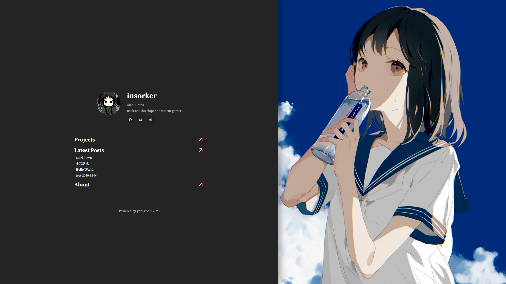

<h1 align="center">
yori-vue
</h1>

<p align="center">
A static blog generator, based on Vue, inherits from Yori.
</p>

<p align="center">
  <a href="https://github.com/insorker/yori-vue">
    
  </a>
</p>

<p align="center">
  <a href="https://insorker.github.io/">Demo</a> | <a href="#install">Install</a> | <a href="#usage">Usage</a>
</p>

<p align="center">
  
  
</p>

Another tiny static blog generator, hahaha. The predecessor of the yori-vue project is [yori](https://github.com/insorker/yori), so their goals are aligned:

<p align="center">
  <b><i>Aim to help you break free from modern, convenient but resource-heavy tools.</b></i>
</p>

I have tried some modern SSGs and finally decided to build one myself, so I wrote this. I hope you will enjoy this project.

PS: The detailed implementation approach is documented in [this article (还没写)]('') for reference purposes.

## Install

> There is no guarantee that the latest version is the final version, but it may be a stable version.
> 
> The project is currently in development stage and will be released on npm after development is completed.

Git clone this repository and run `npm install`.

## Usage

Configure and create content in the 'docs' folder.

Run `npm run dev` to preview.

Run `npm run build` to build. The output will be placed in the 'dist' folder.

### public

> Change avator in the directory 'public/'

### docs/home

> Config in the file 'home/config.json'.

```json
{
  "html-title": "title in browser",
  "title": "title",
  "profile": ["array of sentences"],
  "social-link": [
    {
      "icon": "icon name in remixicon",
      "link": "link",
      "color": "hex color"
    },
    ...
  ],
  "image-link": "url",
  "image-offset": "-0% <= string <= -100%"
}
```

Find your social link icons on https://remixicon.com/.

### docs/posts

> Put markdown files in the directory 'note/'.

Markdown files need to have a YAML front matter. The front matter should follow the following configuration:

```yml
title: Your Title Here
date: YYYY-MM-DD
brief: Your Brief Here
image?: Image Url (default "")
series?: Series
notbyai?: boolean (default true)
```

"?" is not part of the configuration, it indicates that the option can be left blank. Replace 'YYYY-MM-DD' with the date you created or last modified the file.

> !!! IMPORTANT !!!
>
> Markdown's filename must be english! Since the issue from vue-router below:
>
> https://github.com/vuejs/vue-router/issues/3110
>
> also mentioned here:
>
> https://github.com/vuejs/vue-router/issues/838
>
> https://github.com/vuepress-reco/vuepress-theme-reco-1.x/issues/276

### docs/projects

> Write repositories' infomation in the file 'projects/config.json'.

The format is as follows:

```yml
[
  {
    "name": "",
    "desc": "",
    "link": "",
    "icon": ""
  },
  ...
]
```

Find your project icons on https://icon-sets.iconify.design/.

### docs/about

> Write your about in the file 'about/config.json'.

```yml
[
  {
    "time": "year ~ year",
    "title": "Where was i?",
    "brief": "What have i done?",
    "more": "Tags for me"
  },
  ...
  {
    "time": "year ~ now",
    "title": "Where am i?",
    "brief": "What am i doing?",
    "more": "Tags for me"
  }
]
```

## Deploy

> TODO: Need more development in future.

Clone the repository and then only change the `docs` and the `public` folder.

Run `npm run build`.

Push the dist folder to the repository to deploy on GitHub Pages.

## License

[MIT](LICENSE) License © 2023-Present [insorker](https://github.com/insorker)